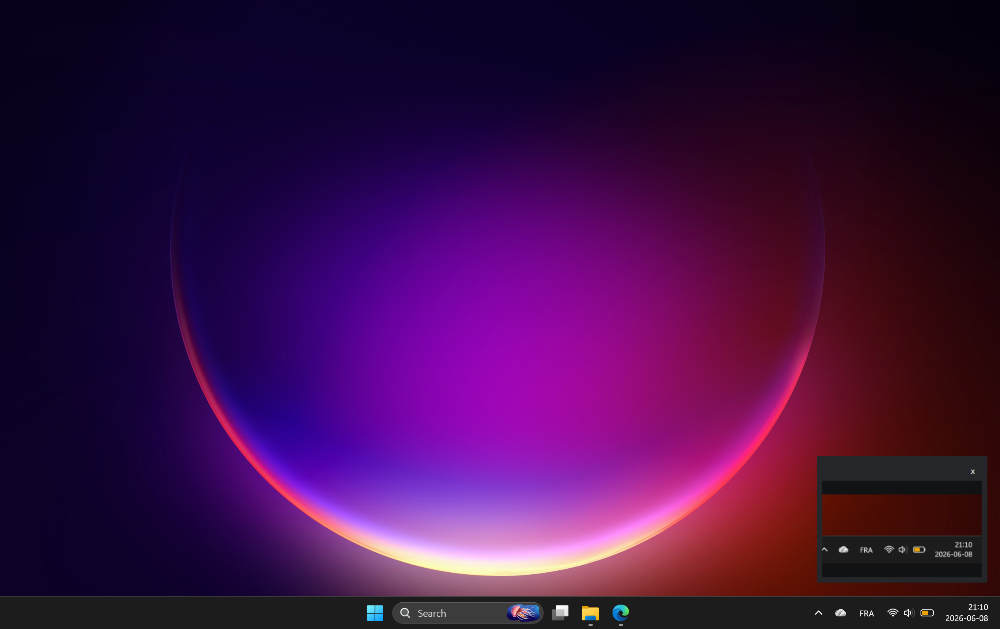

# SnipDrag



SnipDrag gives Windows Snipping Tool a small macOS-style floating thumbnail that you can click or drag.

Windows Snipping Tool is already excellent: `Win+Shift+S` captures quickly, copies to the clipboard, and can autosave screenshots. The missing piece is the little macOS workflow where the floating screenshot preview can be dragged straight into a chat box, browser upload field, GitHub issue, email, or any other app.

SnipDrag keeps Windows Snipping Tool as the capture engine. It watches the clipboard for new screenshot images, shows a small thumbnail at the bottom-right for about five seconds, and turns that thumbnail into a real drag-and-drop image payload.

## What It Does

- Press `Win+Shift+S` exactly like usual.
- A tiny SnipDrag thumbnail appears at the bottom-right.
- Drag the thumbnail into apps that accept dropped images or files.
- Click the thumbnail to open the capture in Snipping Tool for drawing, markup, crop, or save.
- If Snipping Tool already autosaved the screenshot, SnipDrag reuses that original file.
- If no autosaved file exists, SnipDrag creates a temporary bridge PNG and cleans it up automatically.

## Install

1. Download this repository as a ZIP from GitHub.
2. Extract the ZIP.
3. Double-click `install.cmd`.
4. Use `Win+Shift+S`.

The installer copies `SnipDrag.ps1` to:

```text
%LOCALAPPDATA%\Programs\SnipDrag
```

It also creates a Startup shortcut so SnipDrag runs automatically when Windows starts.

## Uninstall

Double-click `uninstall.cmd`.

This stops SnipDrag, removes the Startup shortcut, deletes the installed script, and clears temporary bridge images.

## Optional: Turn Off Snipping Tool Toasts

SnipDrag has a tray icon. Right-click it and choose:

```text
Disable Snipping Tool notifications
```

That keeps the SnipDrag preview from overlapping the native Snipping Tool notification.

You can turn them back on from the same tray menu.

## How It Works

SnipDrag is a small PowerShell + WinForms utility.

It listens for clipboard sequence changes using the Windows clipboard API. When a new image appears, it normalizes the image to PNG, looks for a matching recent file in your Snipping Tool screenshots folder, then shows a no-activate thumbnail window.

Dragging the thumbnail provides:

- `FileDrop` data for apps that accept files.
- Bitmap data for apps that accept image drops.
- PNG stream data for apps that understand raw PNG drops.

Clicking the thumbnail opens the capture in Snipping Tool through the `ms-screensketch://edit/` protocol with a Windows shared file token.

## Requirements

- Windows 11
- Windows Snipping Tool
- Windows PowerShell 5.1, included with Windows

No external packages are required.

## Inspiration

SnipDrag was inspired by the macOS screenshot floating thumbnail. The goal is not to replace Windows Snipping Tool. The goal is to make the already-good Windows capture workflow feel more direct: capture, preview, drag, or mark up.

## License

MIT
